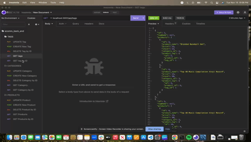

# README-GENERATOR

## Description
The goal of this project is to build the back end for an e-commerce site. It requires Express.js and Sequelize to interact with a MySQL database to use as an ecommerce back end application. The application tracks items by Tags, Categories, and Products. 

## Table of Contents 
-[Installation](#installation) 
-[License](#license) 
-[Questions](#questions) 

## License
MIT

## Questions
To view my projects, please visit https://github.com/adodt.
For questions regarding this project, contact me directly at allidodt@gmail.com.